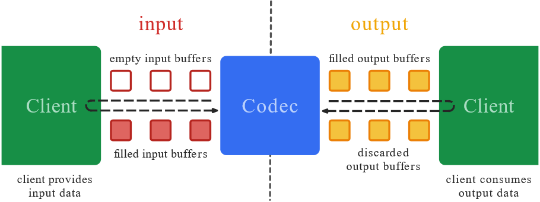
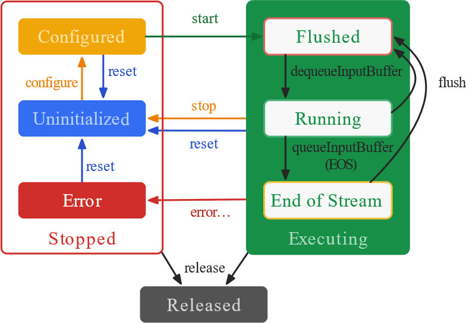

## 工程简介
屏幕录制，并且通过MediaCodec编码成H264文件。通过MediaCodec解码播放H264文件。


## 任务进度
任务                         |    状态   | 备注 
-----------------------------|---------- |--------
应用权限申请                  |    完成    |  
调用系统文件管理器选择文件路径  |    完成   |  
屏幕录制成H264文件            |    未完成   | 
播放H264文件                 |    完成   | 


# MediaCodec简介

MediaCodec用来使用底层多媒体编解码器。 

[官方文档](https://developer.android.com/reference/android/media/MediaCodec.html)

MediaCodec类可以获取底层媒体编码/解码库，是Android底层多媒体支持库的一部分（一般和MediaExtractor、MediaSync、MediaMuxer、MediaCrypto、MediaDrm、Image、Surface、AudioTrack搭配使用）


# MediaCodec的工作原理

宽泛讲编解码器处理输入数据生成输出数据，它的处理是异步的并且使用一系列输入输出buffer。简单层面来说，你请求或者获取空的输入buffer，装满输入之后发送到编解码器处理，在处理结束后编解码器再将数据转换到一个输出的空buffer。最后你请求或者获取装满数据的输出buffer，消耗完其内容数据之后将该buffer释放回编解码器。

MediaCodec采用异步方式处理数据，并且使用了一组输入输出缓存（ByteBuffer）。通过请求一个空的输入缓存（ByteBuffer），向其中填充满数据并将它传递给编解码器处理。编解码器处理完这些数据并将处理结果输出至一个空的输出缓存（ByteBuffer）中。使用完输出缓存的数据之后，将其释放回编解码器：


另外编码工作流是这样的： 以编码为例，首先要初始化硬件编码器，配置要编码的格式、视频文件的长宽、码率、帧率、关键帧间隔等等。这一步叫configure。之后开启编码器，当前编码器便是可用状态，随时准备接收数据。下一个过程便是编码的running过程，在此过程中，需要维护两个buffer队列，InputBuffer 和OutputBuffer，用户需要不断出队InputBuffer (即dequeueInputBuffer)，往里边放入需要编码的图像数据之后再入队等待处理，然后硬件编码器开始异步处理，一旦处理结束，他会将数据放在OutputBuffer中，并且通知用户当前有输出数据可用了，那么用户就可以出队一个OutputBuffer，将其中的数据拿走，然后释放掉这个buffer。结束条件在于end-of-stream这个flag标志位的设定。在编码结束后，编码器调用stop函数停止编码，之后调用release函数将编码器完全释放掉，整体流程结束。


# MediaCodec的状态

> - 编解码器的理论状态是三种：停止、执行、释放。
> - 停止状态由包含三个子状态：错误、未初始化、配置。
> - 执行状态包含三个子状态：刷新、运行、结束流。



- 当创建了一个MediaCodec对象，此时MediaCodec处于Uninitialized状态。首先，需要使用configure(…)方法对MediaCodec进行配置，这时MediaCodec转为Configured状态。然后调用start()方法使其转入Executing状态。在Executing状态可以通过上述的缓存队列操作处理数据。

- Executing状态包含三个子状态： Flushed、 Running 以及End-of-Stream。在调用start()方法后MediaCodec立即进入Flushed子状态，此时MediaCodec会拥有所有的缓存。一旦第一个输入缓存（input buffer）被移出队列，MediaCodec就转入Running子状态，这种状态占据了MediaCodec的大部分生命周期。当你将一个带有end-of-stream marker标记的输入缓存入队列时，MediaCodec将转入End-of-Stream子状态。在这种状态下，MediaCodec不再接收之后的输入缓存，但它仍然产生输出缓存直到end-of- stream标记输出。你可以在Executing状态的任何时候通过调用flush()方法返回到Flushed子状态。

- 通过调用stop()方法使MediaCodec返回到Uninitialized状态，因此这个MediaCodec可以再次重新配置 。当使用完MediaCodec后，必须调用release()方法释放其资源。

- 在极少情况下MediaCodec会遇到错误并进入Error状态。这个错误可能是在队列操作时返回一个错误的值或者有时候产生了一个异常导致的。通过调用 reset()方法使MediaCodec再次可用。你可以在任何状态调用reset()方法使MediaCodec返回到Uninitialized状态。否则，调用 release()方法进入最终的Released状态。


# 打印设备所有编解码器

首先获取MediaCodec支持的数量，根据MediaCodec的句柄获取MediaCodec支持的编解码格式：
> MediaCodecList.getCodecCount();
> 
> MediaCodecList.getCodecInfoAt(i);

比如通过以下测试代码，就可以知道终端MediaCodec的解码能力：

```java
    private void printAllCoder() {
        int codecCount = MediaCodecList.getCodecCount();
        for (int i = 0; i  < codecCount; i++)  {
            MediaCodecInfo codecInfo = MediaCodecList.getCodecInfoAt(i);
            String sInfo = "";
            if (codecInfo.isEncoder()) {
                sInfo += "ENCODER " + codecInfo.getName() + " ";
            } else {
                sInfo += "DECODER " + codecInfo.getName() + " ";
            }

            String[] types = codecInfo.getSupportedTypes();
            for (String sType : types) {
                if (sType.equalsIgnoreCase("video/avc")) {
                    if (!codecInfo.isEncoder()) {
                        Log.v("printAllCoder", "查找到支持 video/avc 的解码器");
                    }
                }
                Log.d("printAllCoder",  sInfo + sType);
            }
        }
    }
```


## 图像的高和宽在H264的SPS帧中。
在H264码流中，都是以`"0x00 0x00 0x01"`或者`"0x00 0x00 0x00 0x01"`为开始码的,找到开始码之后,使用开始码之后的第一个字节的低5位判断是否为`7(sps)`，等于7表示该帧就是`SPS`帧，从该帧就可以解析出高和宽，`SPS`是个结构体，里面有两个成员：`pic_width_in_mbs_minus1`，`pic_height_in_map_units_minus_1`，分别表示图像的宽和高，以宏块（16x16）为单位的值减1，因此，实际的宽为 `(pic_width_in_mbs_minus1+1)*16`，高为`(pic_height_in_map_units_minus_1+1)*16`